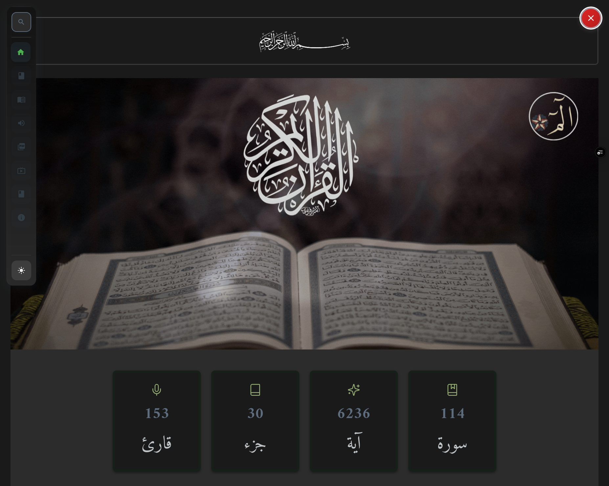

# 🕌 تطبيق القرآن الكريم



## 📖 نظرة عامة

تطبيق ويب شامل لقراءة وتصفح القرآن الكريم مع ميزات متقدمة للتفاعل والاستماع. يوفر التطبيق تجربة مستخدم متميزة مع دعم كامل للغة العربية والوضع المظلم.

## ✨ الميزات الرئيسية

### 📚 تصفح القرآن
- **عرض المصحف بصيغة SVG** مع إمكانية التكبير والتصغير
- **تصفح بالصفحات** مع تنقل سلس بين الصفحات
- **عرض السور** مع جميع الآيات والتفسير
- **بحث متقدم** في النصوص والسور

### 🎵 الصوتيات والتلاوة
- **158+ قارئ** من أشهر قراء العالم الإسلامي
- **تزامن دقيق** للآيات مع الصوت (19 قارئ)
- **تظليل الآيات** أثناء التلاوة
- **تحكم كامل** في التشغيل والإيقاف

### 🎨 واجهة المستخدم
- **تصميم عصري** مع Material-UI
- **دعم الوضع المظلم/النهاري**
- **تجاوب كامل** مع جميع الأجهزة
- **خطوط عربية أصيلة** (الخط العثماني)

### 📖 التفسير والمشاركة
- **تفسير متعدد المصادر** (الجلالين، ابن كثير، السعدي)
- **مشاركة الآيات** مع التفسير
- **نسخ النصوص** بسهولة
- **أرقام عربية** للآيات والصفحات

## 🛠️ التقنيات المستخدمة

### Frontend
- **Next.js 15** - إطار عمل React
- **Material-UI** - مكتبة المكونات
- **React Hooks** - إدارة الحالة
- **CSS Modules** - تنسيق الأنماط

### البيانات
- **JSON محلي** - 6,236 ملف للآيات
- **APIs خارجية** - للتوقيتات والتفسير
- **SVG** - صور صفحات المصحف
- **MP3** - ملفات الصوت

### الأدوات
- **PNPM** - مدير الحزم
- **ESLint** - فحص الكود
- **Prettier** - تنسيق الكود

## 🚀 التثبيت والتشغيل

### المتطلبات
- Node.js 18+
- PNPM

### خطوات التثبيت

```bash
# استنساخ المشروع
git clone https://github.com/Msr7799/test_quran_app.git

# الانتقال للمجلد
cd test_quran_app

# تثبيت التبعيات
pnpm install

# تشغيل الخادم المحلي
pnpm dev
```

### البناء للإنتاج

```bash
# بناء المشروع
pnpm build

# تشغيل الإنتاج
pnpm start
```

## 📁 هيكل المشروع

```
src/
├── components/          # المكونات القابلة لإعادة الاستخدام
│   ├── AudioPlayer/     # مشغل الصوت والتوقيتات
│   ├── QuranPage/       # عرض صفحات المصحف
│   └── ...
├── pages/              # صفحات التطبيق
│   ├── quran/          # صفحات السور
│   ├── quran-pages/    # تصفح المصحف
│   ├── quran-sound/    # الصوتيات
│   └── ...
├── styles/             # ملفات الأنماط
├── utils/              # الأدوات المساعدة
└── hooks/              # React Hooks مخصصة

public/
└── json/               # البيانات المحلية
    ├── audio/          # ملفات الصوت (114)
    ├── surah/          # بيانات السور (114)
    ├── verses/         # ملفات الآيات (6,236)
    ├── metadata.json   # البيانات الوصفية
    └── quranMp3.json   # قائمة القراء
```

## 🌐 الصفحات الرئيسية

| الصفحة | الوصف | المسار |
|---------|--------|--------|
| **الرئيسية** | نظرة عامة وروابط سريعة | `/` |
| **تصفح المصحف** | عرض صفحات القرآن | `/quran-pages/[page]` |
| **السور** | قراءة السور مع التفسير | `/quran/[surahId]` |
| **الصوتيات** | استماع للتلاوات | `/quran-sound` |
| **البحث** | البحث في القرآن | `/search` |

## 📊 إحصائيات البيانات

- **114 سورة** كاملة
- **6,236 آية** منفصلة
- **158+ قارئ** متاح
- **19 قارئ** مع تزامن دقيق
- **604 صفحة** من المصحف
- **77,429 كلمة** في القرآن
- **323,015 حرف** إجمالي

## 🔗 APIs المستخدمة

### التوقيتات
- `https://mp3quran.net/api/v3/ayat_timing/reads` - قائمة القراء
- `https://mp3quran.net/api/v3/ayat_timing` - توقيتات الآيات

### الصور
- `https://www.mp3quran.net/api/quran_pages_svg/` - صفحات SVG

### التفسير
- `http://api.quran-tafseer.com/quran/` - تفسير الآيات

## 🤝 المساهمة

نرحب بالمساهمات! يرجى:

1. Fork المشروع
2. إنشاء branch جديد (`git checkout -b feature/amazing-feature`)
3. Commit التغييرات (`git commit -m 'Add amazing feature'`)
4. Push للـ branch (`git push origin feature/amazing-feature`)
5. فتح Pull Request

## 📄 الترخيص

هذا المشروع مرخص تحت رخصة MIT - راجع ملف [LICENSE](LICENSE) للتفاصيل.

## 👨‍💻 المطور

**محمد الرميحي** - [@Msr7799](https://github.com/Msr7799)

## 🙏 شكر وتقدير

- **mp3quran.net** - للتوقيتات وصفحات SVG
- **quran-tafseer.com** - لخدمة التفسير
- **Material-UI** - لمكتبة المكونات
- **Next.js** - لإطار العمل الرائع

---

<div align="center">

**بُني بـ ❤️ لخدمة كتاب الله الكريم**

[🌐 الموقع المباشر](https://msr-quran-app.vercel.app) | [📚 دليل API](API_USE.md) | [🐛 الإبلاغ عن خطأ](https://github.com/Msr7799/test_quran_app/issues)

</div>